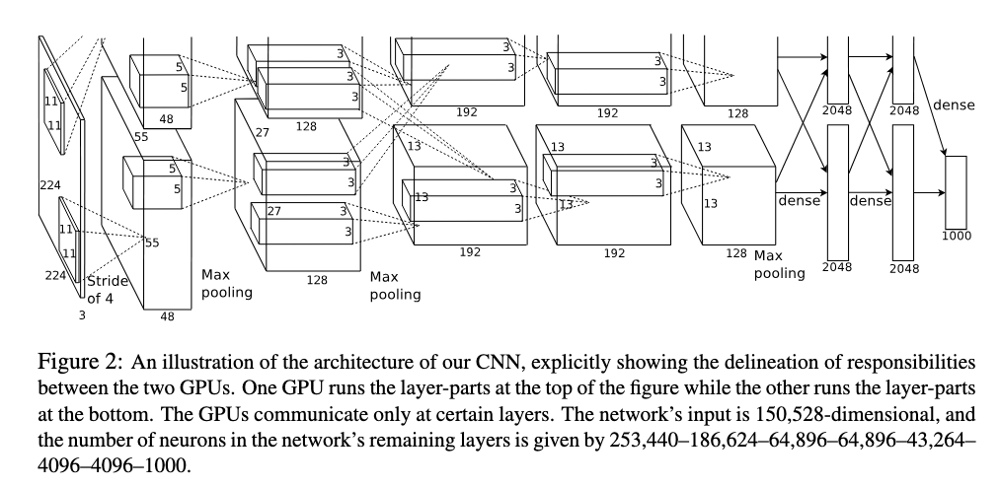

# AlexNet
PyTroch implementation of AlexNet described in the revolutionary paper [ImageNet Classification with Deep Convolutional
Neural Networks](https://proceedings.neurips.cc/paper_files/paper/2012/file/c399862d3b9d6b76c8436e924a68c45b-Paper.pdf) from Hinton, Krizhevsky and Sutskever.


*Taken from "ImageNet Classification with Deep Convolutional
Neural Networks", Krizhevsky et al., 2012*

## Usage

#### Creating AlexNet
```python
import torch
from alexnet import AlexNet

# Creating AlexNet
alxnet = AlexNet(num_classes=1000)

# Random input of shape [128, 3, 227, 227]
x = torch.rand((128, 3, 227, 227))

# Output will have shape [128, 1000]
out = alxnet(x)
```

#### Loading AlexNet (trained)
I have trained AlexNet on a subset of ImageNet1k on my poor RTX2060 6GB, the parameters can be downloaded `here`.

```python
import torch
from alexnet import AlexNet

# Creating AlexNet
alxnet = AlexNet(num_classes=1000)

# Loading the parameters
alxnet.load_state_dict(torch.load('./alexnet_state_dict.pth', weights_only=True))

# Have fun with inference
output = alxnet(...)
```

## Experiments

## Citations

```bibtex
@inproceedings{krizhevsky2012imagenet,
  title     = {Imagenet Classification with Deep Convolutional Neural Networks},
  author    = {Krizhevsky, Alex and Sutskever, Ilya and Hinton, Geoffrey E.},
  booktitle = {Advances in Neural Information Processing Systems},
  year      = {2012},
  pages     = {1097--1105},
}
```

```bibtex
@inproceedings{Deng2009Imagenet,
  author    = {Deng, Jia and Dong, Wei and Socher, Richard and Li, Li-Jia and Li, Kai and Fei-Fei, Li},
  title     = {ImageNet: A large-scale hierarchical image database},
  booktitle = {2009 IEEE Conference on Computer Vision and Pattern Recognition (CVPR)},
  year      = {2009},
  pages     = {248--255},
  doi       = {10.1109/CVPR.2009.5206848},
}

```

